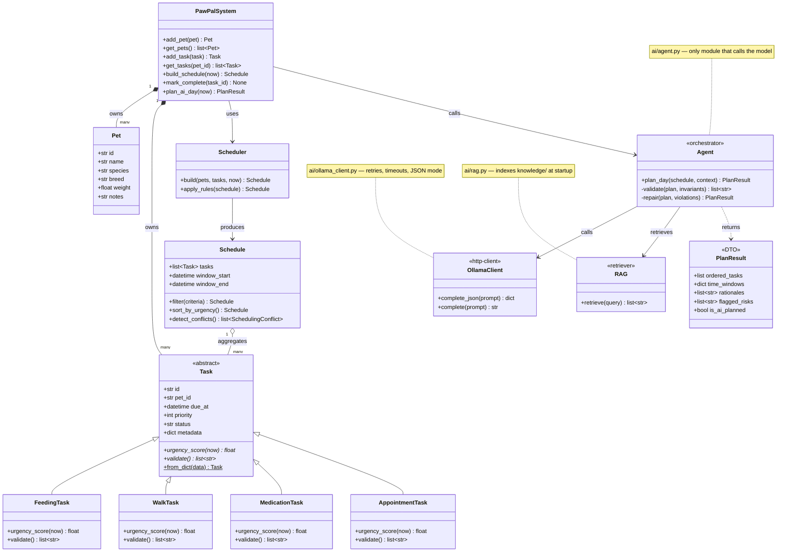
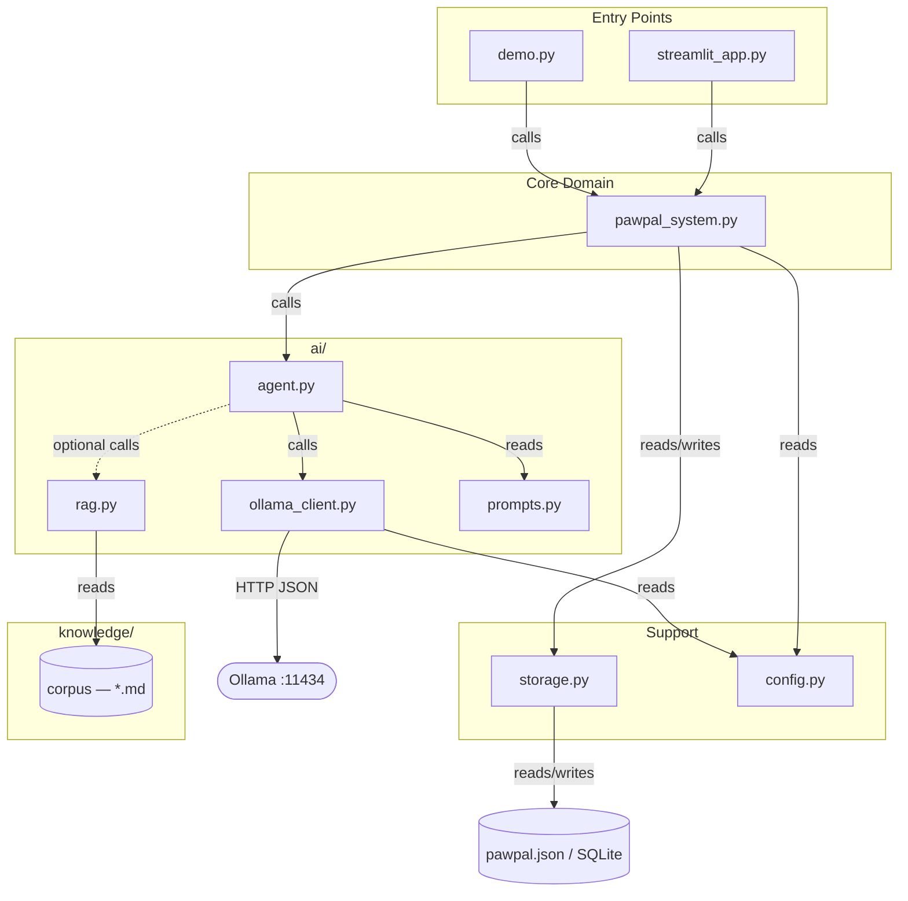
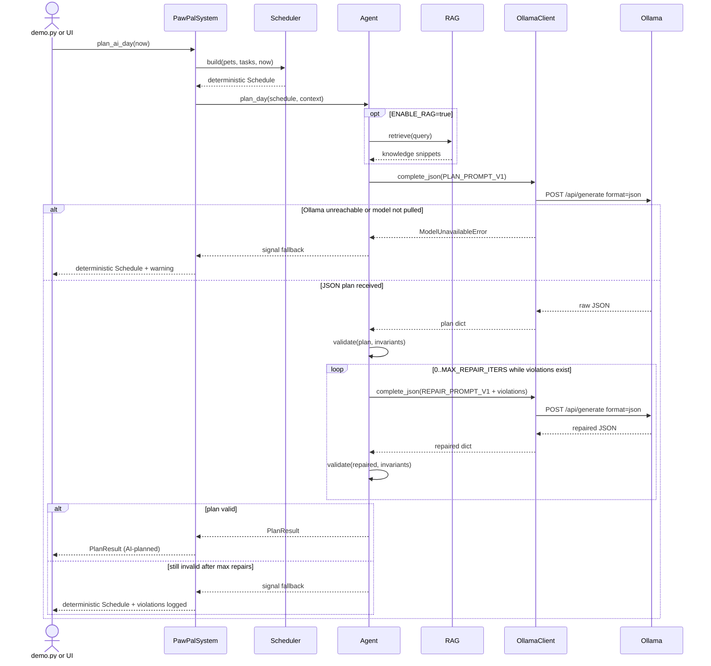

# PawPal+ — Architecture Diagrams

> Edit this file freely. If a diagram renders incorrectly, paste the code block into
> https://mermaid.live for live preview and editing.

---

## Assumptions

- `plan_ai_day(now)` is the inferred public method name on `PawPalSystem` that triggers the
  agent; actual name may differ.
- `PlanResult` is treated as a DTO (dataclass or TypedDict); fields are inferred from the
  JSON plan description in CLAUDE.md §5.
- `Agent`'s `validate` and `repair` are private methods — CLAUDE.md implies no separate
  Validator class.
- `OllamaClient` exposes `complete_json(prompt)` for JSON-mode and `complete(prompt)` for
  plain calls (inferred from "JSON mode for plan and repair calls").
- `RAG` is a class that indexes `knowledge/` at instantiation; `retrieve(query)` signature
  is inferred from the data-flow description.
- `Scheduler.apply_rules` is explicitly named in CLAUDE.md §9.
- `config.py`, `storage.py`, and `logging_setup.py` are module-level utilities with no
  named classes; present in the component diagram only.
- The malformed-JSON re-ask (an `OllamaClient` detail) is collapsed into the
  "Ollama error" alt branch in the sequence diagram for readability.

---

## Diagram 1 — Class Diagram

---

## Diagram 2 — Component / Package Diagram

---

## Diagram 3 — Sequence: AI-Planned Day

---

## Design Notes

- **Hard boundary at the facade.** Both entry points (`streamlit_app.py`, `demo.py`) and
  `Agent` talk only to `PawPalSystem`. Neither Scheduler, storage, nor the Ollama client
  is accessed from outside its designated layer.
- **Single responsibility per module.** `Scheduler` and all `Task` subclasses are pure
  (no I/O, no randomness); `storage.py` is pure I/O with no business logic; `config.py`
  is the only place that reads `os.environ`; `agent.py` is the only place that calls
  the model.
- **Correctness enforced by the Python validator, not the LLM.** The validator checks hard
  invariants (medication spacing, walk cooldown, day boundaries). LLM output is accepted
  only after passing validation — or is repaired until it does. An invalid plan is never
  returned.
- **Deterministic fallback is always available.** `Scheduler → Schedule` runs before any
  AI call and is returned whenever the agent path fails, so the app is never blocked by
  Ollama availability.
- **Prompt versioning protects eval baselines.** Prompts are named constants
  (`PLAN_PROMPT_V1`, `REPAIR_PROMPT_V1`) in `ai/prompts.py`. The old version is kept
  until `eval/run_eval.py` confirms the new version does not regress.
- **RAG is additive and gated.** Retrieval augments prompts but has no write path and can
  be disabled via `ENABLE_RAG=false` without changing any other module's behavior.
